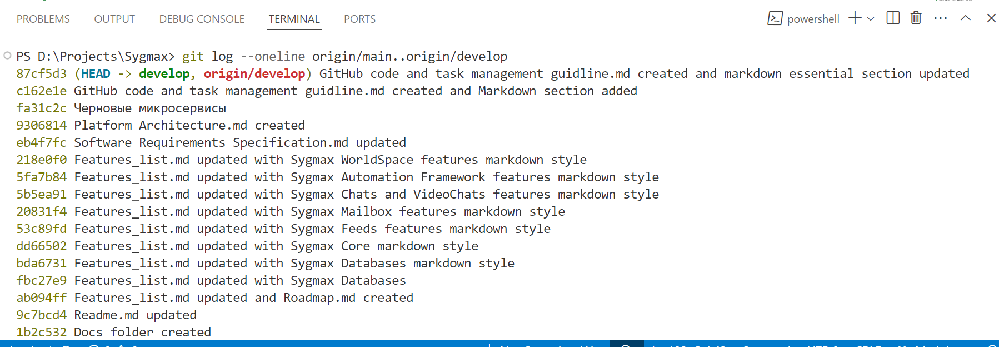
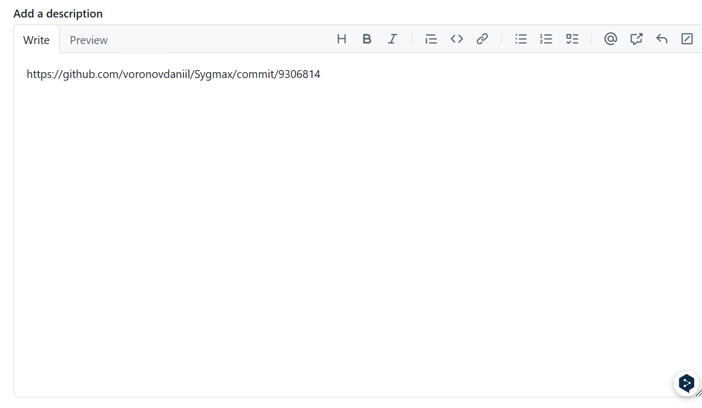
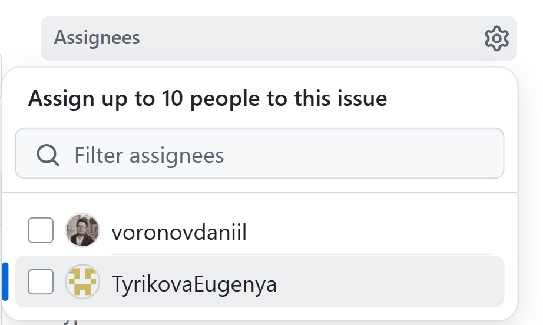
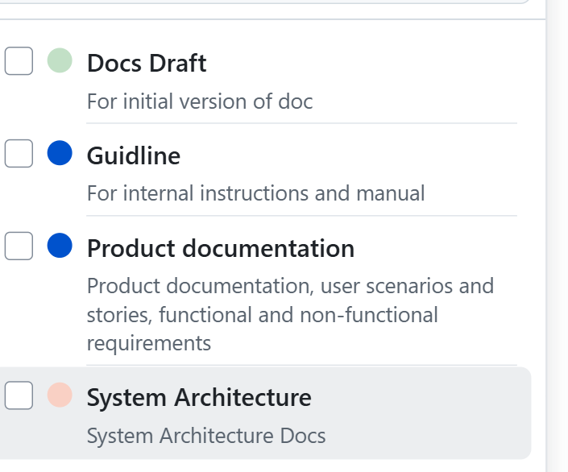
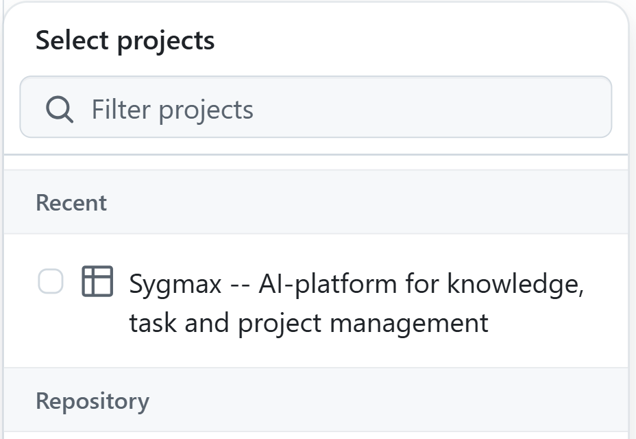
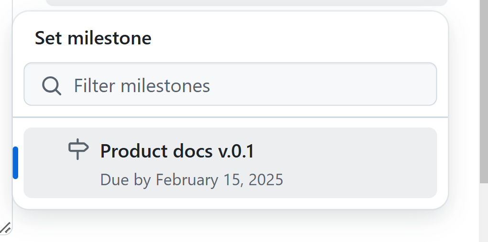
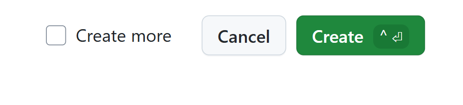

# Руководство по оформлению технической документации и публикации на GitHub

Это руководство посвящено тому, как правильно 
оформить техническую документацию и иного рода материалы 
для последующей публикации в удаленном репозитории GitHub

Руководство на данный момен состоит из двух частей:
1. Основы языка разметки Markdown
2. Руководство по ведению задач, связанных с полным циклом создания документации,
которое включает в себя 
    1. Отправка документов в удаленный репозиторий
    2. Открытие/закрытие issue и создание связанной с ней задачи в таск-трекере

Руководство будет дополняться по мере дальнейшей разработки 
стандартов написания и ведения технической документации под 
руководством Технического писателя в сотрудничестве с остальными членами команды.

## Введение в язык разметки Markdown

Для того, чтобы вашим документом было удобно пользоваться и 
при необходимости также легко дорабатывать, необходимо, чтобы 
структура вашего документа соотвествовала языку разметки Markdown 
и бвзовым принципам оформдения технической документации.
Ниже приведены основные положения этого языка и структуры разметки, 
а также дополнительные ресурсы, которые помогут углубить 
понимание этой технологии.

Markdown — это легковесный язык разметки, 
предназначенный для форматирования текста 
с использованием простого синтаксиса. 
Он широко используется в технической документации, 
README-файлах, вики-страницах и блогах разработчиков.

Markdown позволяет быстро и удобно создавать 
отформатированные документы, которые легко читаются 
в сыром виде и могут быть преобразованы в HTML или другие форматы.

### Заголовки
Заголовки создаются с помощью символа #. Количество # определяет уровень заголовка:

# Заголовок 1 уровня
## Заголовок 2 уровня
### Заголовок 3 уровня
#### Заголовок 4 уровня
##### Заголовок 5 уровня
###### Заголовок 6 уровня
Результат:
Заголовок 1 уровня
Заголовок 2 уровня
Заголовок 3 уровня
Заголовок 4 уровня
Заголовок 5 уровня
Заголовок 6 уровня

### Форматирование текста
Выделение текста в Markdown выполняется следующими способами:

*Курсив* или _Курсив_
**Жирный** или __Жирный__
***Жирный курсив*** или ___Жирный курсив___
~~Зачеркнутый текст~~
Результат:
Курсив или Курсив
Жирный или Жирный
Жирный курсив или Жирный курсив
Зачеркнутый текст

### Списки
#### Ненумерованные списки
Используйте -, + или * для создания списка:

- Элемент 1
- Элемент 2
  - Подэлемент 2.1
  - Подэлемент 2.2
- Элемент 3
Результат:
Элемент 1
Элемент 2
Подэлемент 2.1
Подэлемент 2.2
Элемент 3
#### Нумерованные списки
Нумерованный список создается цифрами с точкой:

1. Первый элемент
2. Второй элемент
   1. Подэлемент 2.1
   2. Подэлемент 2.2
3. Третий элемент
Результат:
Первый элемент
Второй элемент
Подэлемент 2.1
Подэлемент 2.2
Третий элемент

### Цитаты
Цитаты создаются с помощью >:

> Это цитата.
>> Это вложенная цитата.

### Ссылки

Ссылки можно оформлять в двух форматах:

[Текст ссылки](https://example.com)

[Текст ссылки с всплывающей подсказкой](https://example.com "Подсказка при наведении")

### Изображения

Для вставки изображения используйте синтаксис:

### Таблицы

Для создания таблиц используйте | и -:

| Заголовок 1 | Заголовок 2 | Заголовок 3 |
|-------------|------------|------------|
| Данные 1    | Данные 2   | Данные 3   |
| Данные 4    | Данные 5   | Данные 6   |

### Чек-листы

Markdown поддерживает чек-листы:

- [x] Выполненный пункт
- [ ] Невыполненный пункт

## Полезные источники по Markdown

### Официальные и базовые ресурсы:

1. **[Официальная документация Markdown (Daring Fireball)](https://daringfireball.net/projects/markdown/)**
   _Первый и основной источник информации о Markdown от его создателя Джона Грубера._

2. **[GitHub Flavored Markdown (GFM)](https://github.github.com/gfm/)**
   _Расширенная версия Markdown, используемая на GitHub, включая поддержку чек-листов, таблиц и выделенного синтаксиса для кода._

3. **[CommonMark Specification](https://spec.commonmark.org/)**
   _Современный стандарт Markdown с четкими спецификациями и тестами совместимости._

4. **[Markdown Guide](https://www.markdownguide.org/)**
   _Подробный интерактивный гайд по основам и расширенным возможностям Markdown._

### Интерактивные инструменты и песочницы:

5. **[Dillinger](https://dillinger.io/)**
   _Онлайн-редактор Markdown с превью, поддержкой синхронизации с облачными сервисами и экспортом в PDF/HTML._

6. **[StackEdit](https://stackedit.io/)**
   _Продвинутый онлайн-редактор Markdown с поддержкой GitHub, Google Drive и Dropbox._

7. **[Markdown Live Preview](https://markdownlivepreview.com/)**
   _Простая веб-песочница для тестирования Markdown в реальном времени._

### Полезные статьи и блоги:

8. **[Markdown Tutorial by Markdown Guide](https://www.markdownguide.org/basic-syntax/)**
   _Полный учебник по основам и расширенному синтаксису Markdown._

9. **[Converting Markdown to PDF/HTML using Pandoc](https://pandoc.org/MANUAL.html)**
   _Руководство по преобразованию Markdown в другие форматы с помощью Pandoc._

## Как правильно отправить техническую документацию 
## и прочие материалы в удаленный репозиторий GitHub

После того, как вы успешно написали и отредактировали свой документ, 
можете смело отправлять его в удаленный репозиторий.

Делается это тремя стандартными командами, выполненными из консоли:

git add .
git commit -m "Описание вашего коммита"
git push -u origin "название ветки, в которую делаете коммит"

После этого ваши обновленные материалы будут отправлены
в ужную ветку.

Далее вам необходимо правильным образом завести issue и task в 
таск-трекере репозитория.

1. В косноли вашего IDE введите команду:
git log --oneline origin/main..origin/develop

В ответ вы получите список ваших коммитов.

2. Выделяем строку с последним коммитом (она находится в самом верху списка) и копируем ее в буфер обмена
3. Далее идем на https://chatgpt.com/share/67ae35ec-399c-8007-8af8-b70981de861f 
и вставляем туда номер нашего коммита
4. В ответ получаем рабочую ссылку на наш коммит
5. Идем в репозиторий и переходим во влкдау Issues

6. Создаем новый Issue

7. В открывающейся карточке 
заполняем название нашего issue, а в поле
Description вставляем ссылку на ваш последний коммит, 
который вы сформировали с помощью чата.

8. После этого переходим к заполнению данных о проекте

Выберите того, кто будет проверять ваш документ

Выберите категорию вашего документа.

N.B.  На данный момент доступны три категории документа:
- если ваш длокумент относится к системной архитектуре -- выбирайте соответствующую категорию
- если ваш документ относиться к описанию функциональности продукта с точки зрения конечного потребителя и пользователя -- выбирайте соответствующую категорию
- если ваш документ относится к практическим руководствам/мануаоам - выбирайте соответствующую категорию

- если ваш документ только что написан и представляет собой черновик -- *отметьте дополнительно пункт Draft!*

- Выберите проект

- выберите майлостоун

9. Завершите создание issue

